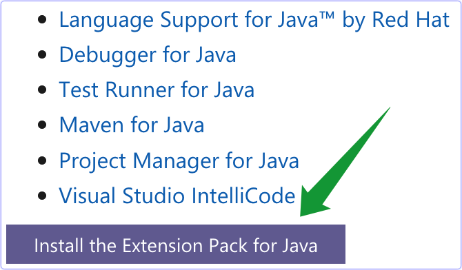

# 设置Java编程环境

## YouTube 教程的网址
* https://www.youtube.com/watch?v=JyP6YOHl2_g

## 安装VS Code和扩展

* 安装 vs code √

* 装好后, 打开vscode的教程网址:https://code.visualstudio.com/docs/java/java-tutorial √

* 下载和安装编程工具包 https://aka.ms/vscode-java-installer-mac √这个包的大小为97.3MB.

* 解压zip文件后, 双击解压出来的文件, 进行安装√

* 

* 仍然在这个教程网页, 安装vscode的Java扩展包√

* 

