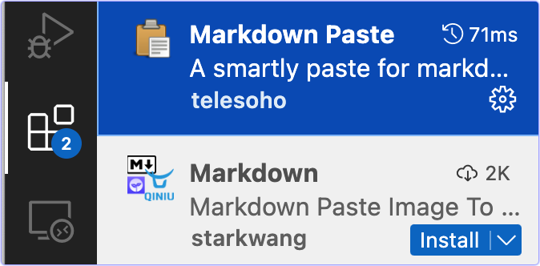
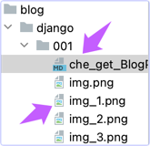
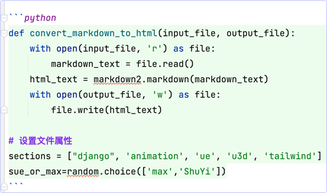

blog文章编辑规范

# 文章用Markdown格式写
* 请在vscode用Markdown格式写blog文章√
  * 文件名存为.md√

> Markdown编辑器会把剪贴板中的图片, 直接变成文件链接, 然后粘贴到Markdown文本中. 在预览中能够直接看到图片.

# 文章的的标题从一级标题开始分层次
* md文件的第一行是blog的标题, 不要删掉.√

# 插入图片
* 可以直接把ishot剪切出来的图片, 粘贴到这里. 粘贴的时候, md 会把链接直接贴在这里。感觉图片有些模糊, 但勉强可用. 可以试一下在浏览器中渲染出来的效果会是什么样的。√
* 即使是从网络上拷贝出来的图片, 它也会复制到本地, 并修改名字.


# 插入更多的图片
* 为了避免图片与文字混在一起, 文字和图片要用回车符隔开.√

* 剪贴板中的图片和在网络上复制的图片都可以粘贴. 第一幅图片是剪贴板中的图, 第二幅和第三幅是从网络上粘贴来的.

第一幅图 
第二幅图   
第三幅图   

* 想知道图片是插入在哪里的? 
  * 原来插入到了md文件的同一级目录↓√



# 还有三个问题:
* 我们可以把md文档转换为HTML文档吗?√
  * 因为Markdown不支持我们的CheckBox, 因此需要把我们写的md文件转换为HTML发表.
  * 把md文档转换成html文档容易吗?
* 能在md文档中插入代码Python, Bash等风格的代码吗?√
* 试一试看看.

# 插入代码用蝌蚪符 back tick
* 例如, 在Markdown文件中这样写, 注意蝌蚪符后面的python是小写↓√

* 得到的预览结果是这样的↓ 注意插入代码之前, 要先插入一个空行, 避免代码块和其他内容混在一起.√

```python
def convert_markdown_to_html(input_file, output_file):
    with open(input_file, 'r') as file:
        markdown_text = file.read()
    html_text = markdown2.markdown(markdown_text)
    with open(output_file, 'w') as file:
        file.write(html_text)

sections = ["django", 'animation', 'ue', 'u3d', 'tailwind']
sue_or_max=random.choice(['max','ShuYi'])  # 选作者
```

# 总结
* 用起来非常方便. 比HTML简洁多了.