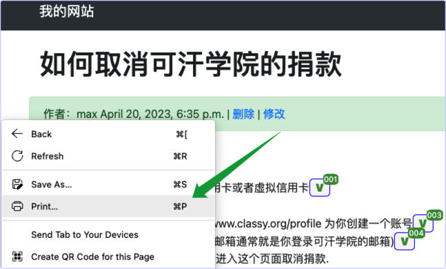
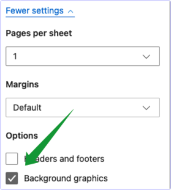

# blog文章Markdown格式编辑规范--正式版本

## 文章用Markdown格式写
* 请在vscode用Markdown格式写blog文章√
* 文件名存为.md√
* 可以打开一个预览窗口, 预览文档↓√
  

> Markdown编辑器会把剪贴板中的图片, 直接变成文件链接, 然后粘贴到Markdown文本中. 在预览中能够直接看到图片. 用Pycharm的问题是, 截图之后, 粘贴到文件中时, 图片的清晰度变得很低.

## 文章的标题从一级标题开始分层次

* md文件的第一行用一个#, 这将是博客文章的标题√
* 内容从二级标题开始 √
* 内容中的标题, 结尾不能是冒号 √
* 对钩符号后面, 不能有空格, 但前面可以有空格 √

## 二级标题示例(这一行是一个二级标题)

* 注意二级标题和三级标题, 它们的字号大小不同, 
* 三级标题还有缩进.

### 三级标题(这一行是三级标题)

* 三级标题可以重点显示一些函数, 并且能够出现在内容目录√
* 二级标题之后, 或者跟三级标题, 或者跟bullet point.
* 三级标题下面是bullet point.

### 关于导航栏

* 文章页面右边有导航栏√
* 导航栏在页面很窄的时候√会自动排列到页面的最下面. 

### 代码

* 代码是可以直接copy的.

## 插入图片

### 在VS中先安装 `Markdown Paste` 插件

* 这是vs code中的插件, 先要装好才能截图√
 

### 贴图: `ctrl+alt+v` 或者 `cmd+opt+v` 

* 用快捷键可以直接把ishot剪切出来的图片, 粘贴到md文档中.√
  * 快捷键按下之后, 注意要回车一下√
    

* 即使是从网络上拷贝出来的图片, 也会被复制到本地, 并修改名字.


## 插入更多的图片

* 为了避免图片与文字混在一起, 文字和图片要用回车符隔开.√


* 剪贴板中的图片和在网络上复制的图片都可以粘贴. 第一幅图片是剪贴板中的图, 第二幅和第三幅是从网络上粘贴来的.

* 第一幅图 


* 又一张图

  

* 想知道图片是插入在哪里的? 
  * 原来插入到了md文件的同一级目录↓√


## md文档转为HTML文档

* 用md2html脚本把md文档转换为HTML文档√
  * 因为Markdown不支持我们的CheckBox, 因此需要把我们写的md文件用脚本转换为HTML发表.

## 插入代码用蝌蚪符 back tick
* 例如, 在Markdown文件中这样写, 注意蝌蚪符后面的python是小写↓√
  

* 得到的预览结果是这样的↓ 注意插入代码之前, 要先插入一个空行, 避免代码块和其他内容混在一起.√

```python
def convert_markdown_to_html(input_file, output_file):
    with open(input_file, 'r') as file:
        markdown_text = file.read()
    html_text = markdown2.markdown(markdown_text)
    with open(output_file, 'w') as file:
        file.write(html_text)

sections = ["abc", 'defg', 'sec3', 'sec4']
random_user=random.choice(['user1','user2'])
```

## 打印
* 先把 Markdown 文件上传到网站, 变成HTML文件√
* 然后在文章页面, 可以用鼠标右键把`Print`功能调出来√

* Save as PDF√
* 打印的时候要进行高级设置√, 才能正常显示`CheckBox`


## 总结
* 用起来非常方便. 比HTML简洁多了.