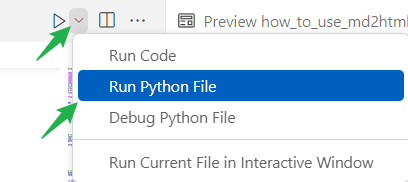

# Markdown格式转HTML格式--执行md2html.py脚本

## 首先编写Markdown格式的文件
* 在合适的目录, 用vscode编写文件√
  * 例如: D:\my_projs\10django_prjs\mysite
  * \static\blog\django\001\ch03\how_to_use_md2html.md

## 在vscode中打开脚本
* 文件的路径为: D:\my_projs\10django_prjs\mysite\md2html.py

## 设置文档的键值对
* 按照下面的格式设置, 检查和修改section, project, chapter的值√

```python
file_meta = {"section": "django", # ue, u3d, tailwind, python, ksp
             "project": "001",
             "chapter": "ch03",
             "title": "",
             "author": yauthor,
             "updated_on": timezone.now(),  # data_time
             "body": "", # text
             "level": "beginner",
             }
```


## 执行脚本
* 按照下图的方式执行

