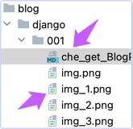

如何编辑能够发表在blog系统中的md文档

## Blog的标题要保留
* md文件的第一行是blog的标题, 不要删掉.

## 插入图片
可以直接把ishot剪切出来的图片, 粘贴到这里. 粘贴的时候, md 会把链接直接贴在这里。感觉图片有些模糊, 但勉强可用. 可以试一下在浏览器中渲染出来的效果会是什么样的。
* 即使是从网络上拷贝出来的图片, 它也会复制到本地, 并修改名字.

## 插入更多的图片
插入第二张图片吧. 这时候图片的名称会自动排序. 为了避免图片与文字混在一起, 文字和图片要用回车符隔开.

试一下截到图片10会怎么样↓

我很想知道图片是插入在哪里的. 看一看?
原来插入到了它的同一级子目录下. 真是不错哦 ↓

## 还有三个问题:
* √我们可以把md文档转换为HTML文档吗?
  * 因为Markdown不支持我们的CheckBox, 因此需要把我们写的md文件转换为HTML发表.
  * √把md文档转换成html文档容易吗?
* √能在md文档中插入代码Python, Bash等风格的代码吗?
* 试一试看看.
* 
