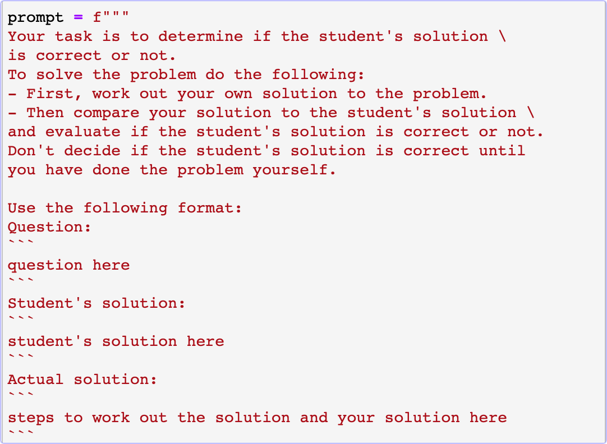
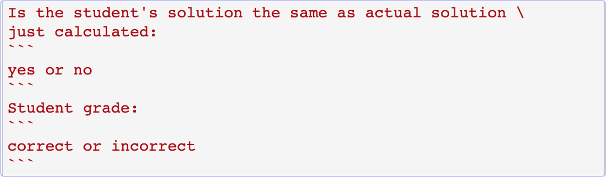
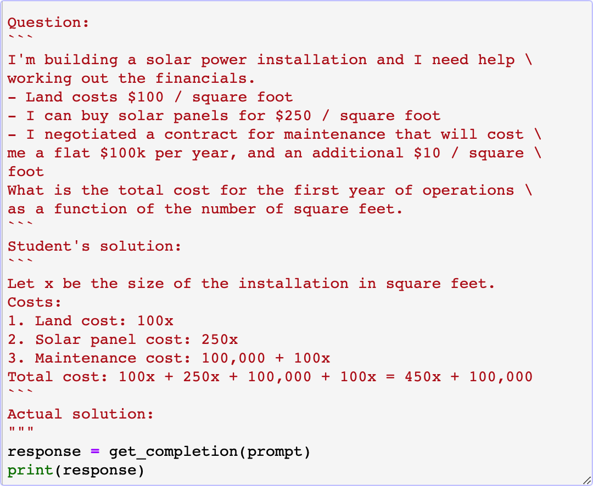

# 吴恩达prompt课程

## 课程链接

* https://learn.deeplearning.ai/chatgpt-prompt-eng/lesson/1/introduction

## Prompting的总原则

1. prompt必须clear和specific

    * clear不等于short. 常犯的错误是prompt写得太短.

2. 让LLM思考, 给它时间去思考

## 原则1

### 技巧1: 使用分隔符, 例如,  ```, """, < >, <tag> </tag>
* triple backticks 用的比较多


### 技巧2: 要LLM返回结构化的输出.
    * 例如, 按照json, HTML, Markdown文件格式输出.

### 技巧3: 要模型检查条件是否得到了满足.

例如:

```python

text_1 = f"""
Making a cup of tea is easy! First, you need to get some \ 
water boiling. While that's happening, \ 
grab a cup and put a tea bag in it. Once the water is \ 
hot enough, just pour it over the tea bag. \ 
Let it sit for a bit so the tea can steep. After a \ 
few minutes, take out the tea bag. If you \ 
like, you can add some sugar or milk to taste. \ 
And that's it! You've got yourself a delicious \ 
cup of tea to enjoy.
"""

prompt = f"""
You will be provided with text delimited by triple quotes. 
If it contains a sequence of instructions, \ 
re-write those instructions in the following format:

Step 1 - ...
Step 2 - …
…
Step N - …

If the text does not contain a sequence of instructions, \ 
then simply write \"No steps provided.\"

\"\"\"{text_1}\"\"\"
"""

```

* 技巧4: few-shot prompting. 

    > 给几个成功完成的任务, 然后要模型依葫芦画瓢.

## 原则2 给模型更多的时间去思考

### 技巧1: 在命令中写出完成任务的步骤

* 第一种提示方法:

```python
text = f"""
In a charming village, siblings Jack and Jill set out on \ 
a quest to fetch water from a hilltop \ 
well. As they climbed, singing joyfully, misfortune \ 
struck—Jack tripped on a stone and tumbled \ 
down the hill, with Jill following suit. \ 
Though slightly battered, the pair returned home to \ 
comforting embraces. Despite the mishap, \ 
their adventurous spirits remained undimmed, and they \ 
continued exploring with delight.
"""
# example 1
prompt_1 = f"""
Perform the following actions: 
1 - Summarize the following text delimited by triple \
backticks with 1 sentence.
2 - Translate the summary into French.
3 - List each name in the French summary.
4 - Output a json object that contains the following \
keys: french_summary, num_names.

Separate your answers with line breaks.

Text:
```{text}```
"""
response = get_completion(prompt_1)
print("Completion for prompt 1:")
print(response)

```

* 第二种提示方法:

```python

prompt_2 = f"""
Your task is to perform the following actions: 
1 - Summarize the following text delimited by 
  <> with 1 sentence.
2 - Translate the summary into French.
3 - List each name in the French summary.
4 - Output a json object that contains the 
  following keys: french_summary, num_names.

Use the following format:
Text: <text to summarize>
Summary: <summary>
Translation: <summary translation>
Names: <list of names in Italian summary>
Output JSON: <json with summary and num_names>

Text: <{text}>
"""
response = get_completion(prompt_2)
print("\nCompletion for prompt 2:")
print(response)

```

### 技巧2: 指导模型自己想出解决方案, 而不是直接给结论

* 提示(截图)







## 模型的弱点和限制: 避免模型疯言疯语

* 先要模型寻找相关的信息. 找不到就让它说找不到.

* 找到的话, 让它在回答问题的时候, 基于这些信息.


## 结尾 