# blueprints初级教程-1

## 啰嗦几句
* 要打钩的地方, 基本上都是要你采取行动的地方.
* 动作都做完了, 教程肯定能够顺利通关√

## 对设备的要求
* 建议准备一个 Pad, 用Pad看教程, 用Mac或者PC实际操作.
    * 最好能够双屏
* 在工作中, 大家都会用英文界面和术语, 所以不要惧怕英文.
* 我的机器用的是 Nvidia 3080 显卡. 还比较流畅.
    * 开发游戏的时候, 建议用性能比较强的机器, 免得因为不流畅而半途而废√
    * 也别自己组装, 买品牌机, 坏了有维修的地方, 免得把时间浪费在修机器上

## 特别提醒
* 把教程中要打钩的地方, 都打上钩就能完成教程√
* 要注意教程图片中有箭头的地方√
* 有些地方是多图, 有问题的时候, 一定要多看几张图片√
* 重复一遍: 有问题的时候, 一定要往下多看几张图片√

## 安装和打开Unreal Engine 5
* 安装和打开Unreal Engine 5; 创建一个名为LearnBP的项目√

 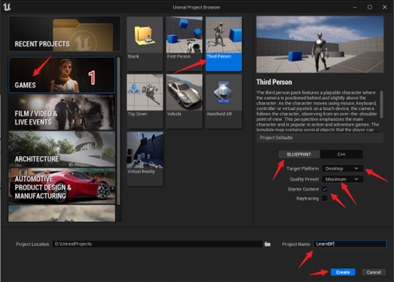

 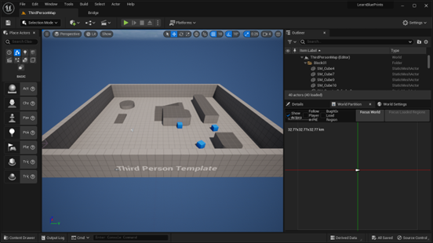

* Play一下√

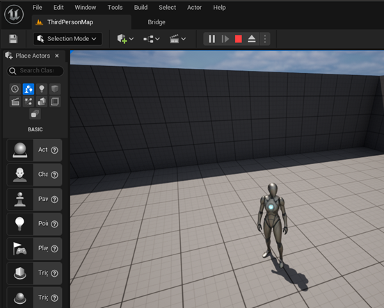
 
## 创建一个Blueprint
* 打开content drawer√

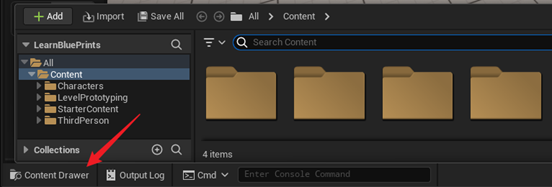
 
* 添加一个文件夹√, 取名Blueprints√

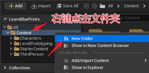 

## 在文件夹中添加一个 Blueprint	 

* 右键点击 Blueprints 文件夹, 按照下图选择 Add/Import Content, 再选择 Blueprint Class√

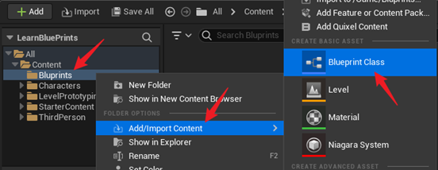  

* 选择 Actor作为这个Blueprint的父类√

 
* 把新建的 Blueprint 改名为 BP_Test√

  

* 在文件夹中双击 BP_Test 打开这个蓝图进行编辑√

* 把 BP_Test 标签页(tab)拖到ThirdPersonMap旁边√

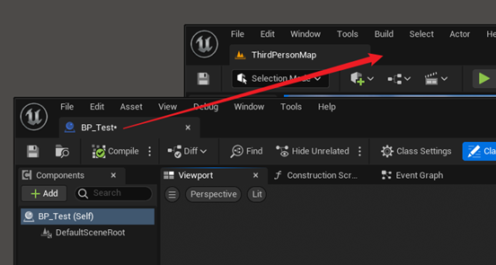  

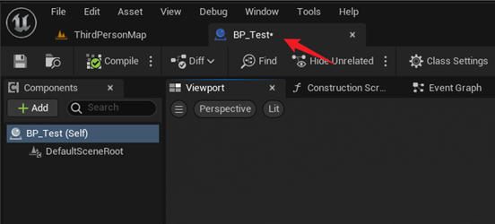  
 
## 给BP添加一个球体
* 在 Components 下面选中BP_Test; 点击Add; 输入sphere; 从提示中选择Sphere; 别选成 Sphere Collision 了√

* 添加 Sphere 之后, Components 下面是这样↓

  

* 特别注意, 哪个组件高亮, 则点击Add的时候, 就会在这个组件的下面添加子组件√

* compile, save√
 	 
* 切换到ThirdPersonMap; 把BP拖到ThirdPersonMap中√

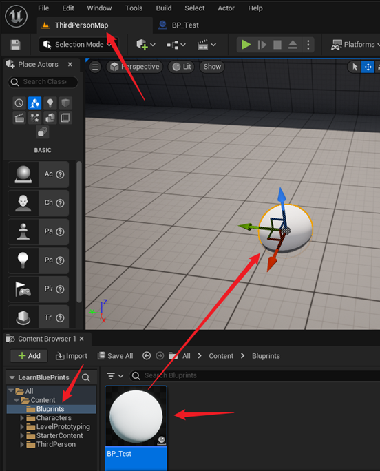  
 
## 修改BP
* 设置BP的大小。
    * 点击 BP_Test 标签, 回到BP_Test蓝图界面√
    * 选中Sphere; 找到Details标签; 把Scale的(x, y, z)的值都设置为0.5√

    

* 在 Details 中找到 Simulate Physics(模拟物理), 勾选√

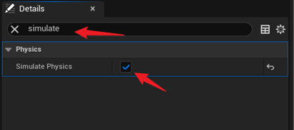  

* save; compile√

* 回到地图, Play, 这时的球应该可以踢了√

## Event Graph

* 找到 BP_Test 的Event Graph 标签, 点击√
    * 操作提示: 在画布的空白处按住鼠标右键不放, 可以拖动整个画布

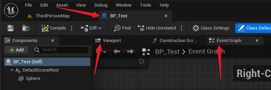
 
* 删除事件 Event BeginPlay√
    * Ctrl_Z 可以撤销删除√
    * 事件删除后, 以后还可以添加.

  

* 添加事件的方法: 右键点击空白处, 搜索要添加的事件, 点击就可以添加√

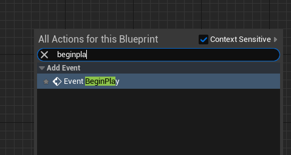

## BeginPlay事件研究

* 对于BP_Test, 一旦我们开始游戏, 就会执行这个Event BeginPlay事件. 对于新出生(spawn)的actor, 也会在spawn时触发这个事件.
* 每个蓝图都可以设置BeginPlay, 使之在游戏开始的时候就按我们的要求行动.

### Print String
* 下面的任务是在游戏界面上打印"您好!".
    * 参考下面的图示, 从Event BeginPlay的引脚拖出一根线√
    * 搜索Print String动作(action)并选择√
    * 把 In String 参数设置为您好√
    * compile save√
    * 切换到Map中去执行√

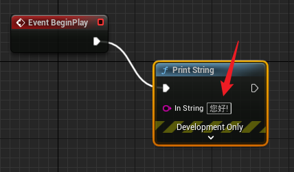

* 执行时能够看到↓

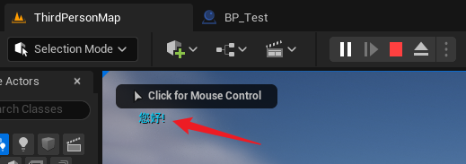

* 如果我们在地图中放置多个BP_Test, 会多次打印 您好!

* 如果我们在Map中添加了很多球, 可以在Map的Outliner中找到添加的BP_Test, 按delete键删除它们√

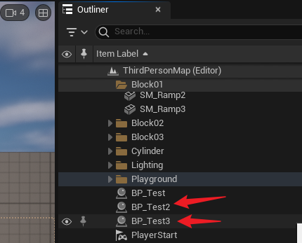

### Get World Scale

* 如果想知道Sphere究竟有多大, 可以使用get world scale方法.
    * 在Details中查看 Sphere 的 scale√
    * 把Sphere拖到编辑器中; 从引脚中引出Get World Scale√
    * 连接 Return Value 和 In String√
    * 展开Development Only, 将持续时间(Duration)设置为5.0秒√

* 注意, 这个 Event Graph 是属于 BP_Test 的. Get World Scale是从Sphere引出的, 因此它的意思是获得 Sphere 在 World 中的 Scale

* compile, save. 到地图中Play. 这是一种很好的调试方法√

## 更改BP的材质(Material)
* 下面有多幅图供参考.
    * 选中Component中的Sphere√
    * 在Details中导航到Sphere的材质(Material)√
    * 更改其材质为M_Brick_Clay_New√
    * 在Map中查看更改效果√
    * 可以ctrl_z把材质再改回BasicShapeMaterial√

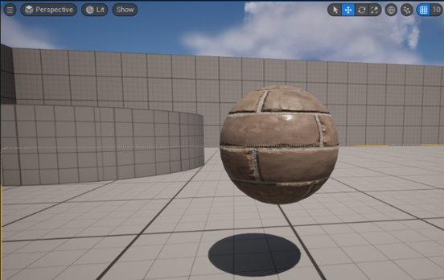

## Set Material

* 回到Event Graph, 我们来用脚本改变材质√

  

* 接上图, 在Print String之后, Set Material√

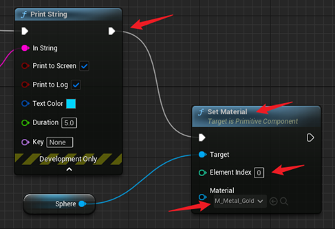

* Play, 测试一下√

### Construction Script
* Construction Script 让我们不用运行程序就能看到预先做好的蓝图实例, 相当于构造函数。例如, 我们可以用 construction script 更改Sphere的材质, 让我们不用运行程序就能看到材质已经更改的小球.

* 在Even Graph中`框选`Blueprint代码; ctrl_c复制; 然后把复制的内容粘贴(ctrl_v)到Construction Script的画布上√

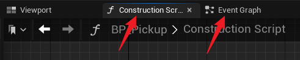

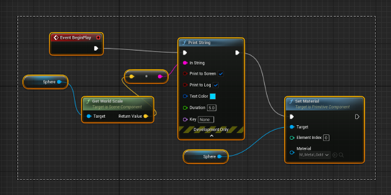

* 依照下图改造一下这个BP; Save; Compile√

 

* 观察: 不用开始游戏, 在编辑器中球就变成金黄色的了。但是看不到Location的三维坐标的显示.

* 打开Output Log, 拖动Sphere的时候, 可以观察到其坐标的改变√

> Construction Script的作用是, 可以预修改Asset的一些属性, 而不是在游戏开始后修改。一个用途是: 让金色的球在空间随机分布; 或者让草木在庭院中随机分布。

## Event Tick
* Tick事件每帧都会执行. 计算机每秒钟一般能运行30到300帧, 这就是帧率(FPS, Frame Per Second)。执行Tick事件需要时间, 因此为了保证游戏的流畅度, 最好只是在必要的时候才使用Tick。

* 查看游戏的FPS(Frame Per Second)√

* Play, 可以看到游戏的帧率√

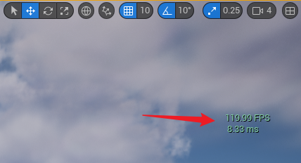

## Text Color -- 显示有色彩的文本. 

### Random Array Item
* 按住 Text Color 前面的引脚, 往左边拖动↓√

* 选择Random Array Item√

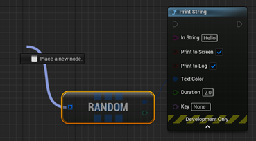

### Make Array
* Make Array√

* 设置颜色
    * 点击下图所示的方框√
    * 设置颜色的Value√
    * 设置饱和度(Saturation)√

* 点击 Pin, 再增加两个元素; 并设置好颜色和饱和度√

* 连上 Event Tick。Compile, Save。Play√

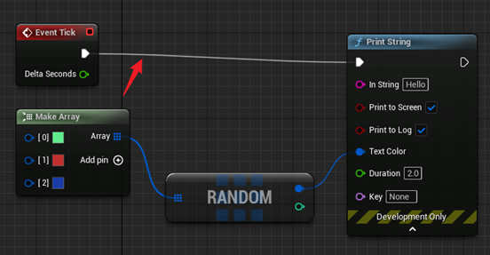

* 使用cmd强制把FPS设为5. 可以看到输出Hello的速度明显慢了很多。而且游戏的流畅度感觉也差了很多√

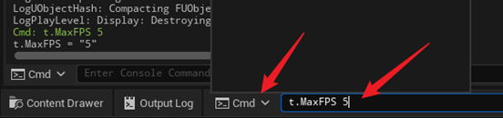

* 将FPS设为0, 恢复到正常状态√

(uebp01--第一部分结束)